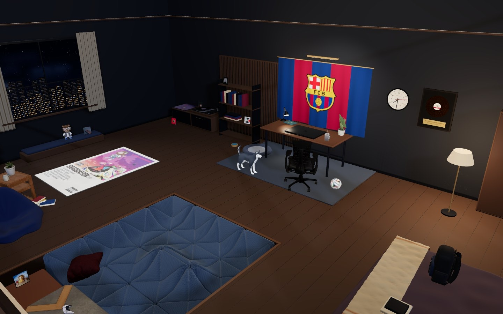
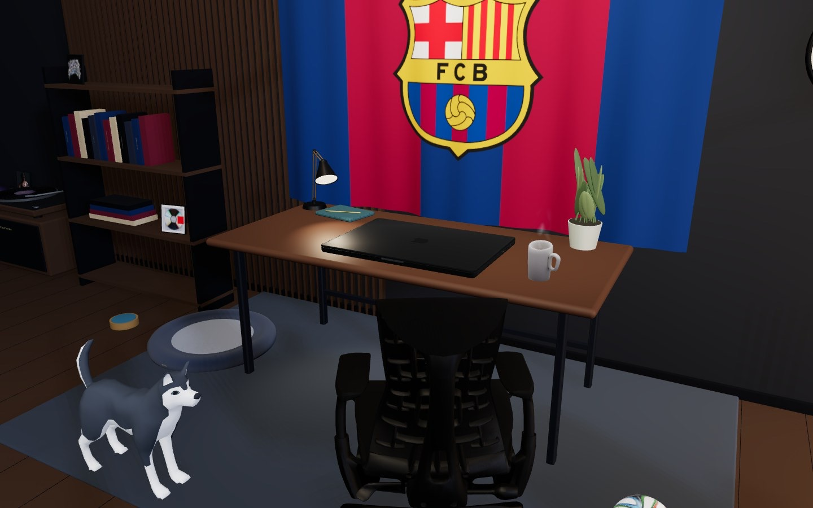
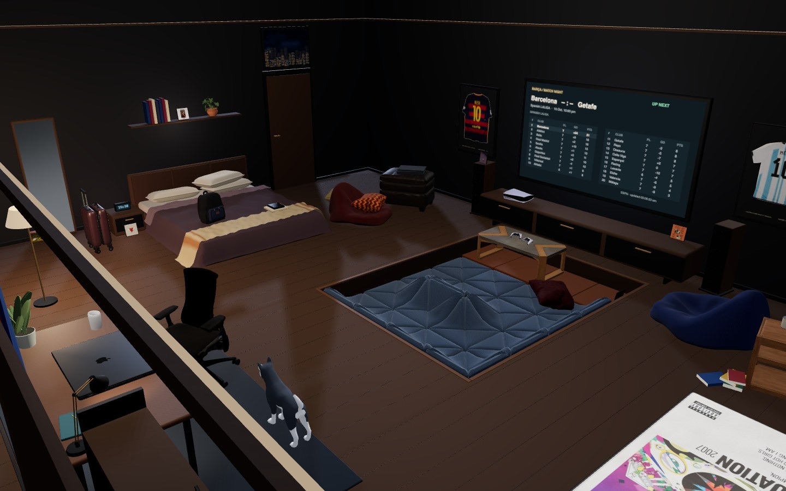
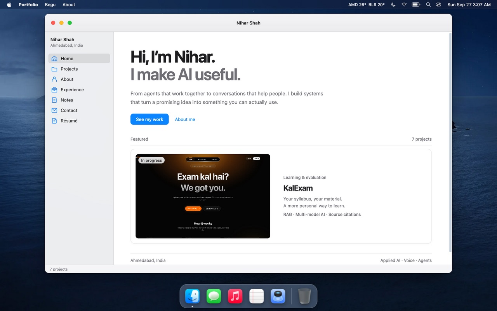

# Nihar Shah: step into my room

A portfolio you walk into. It's a 3D model of my room in the browser, with a MacBook on the desk that opens into a working desktop holding my projects, résumé and an AI version of my husky, Begu.



## What's in the room

- **A blueprint first.** While the room loads, a plotter draws it as a technical drawing: linework rendered from the real scene, from the exact camera the room opens at (`scripts/render-blueprint.js`). Numbered callouts point at the Mac, Begu, the bookshelf and match night. When everything has arrived, the live room fades in precisely under the lines. The title block's Note 1 says the room is designed for a laptop or desktop; on a phone it's highlighted, with the 2D portfolio as the alternative.

- **The Mac.** Sit down at the desk and the lid opens into a macOS-style desktop: portfolio, projects, notes, résumé, a music app and a word game.
- **Begu.** My Siberian husky walks the room, naps, eats, and fetches the football when you kick it. Click him to pet him, or open his chat to ask about my work (Gemini, grounded in my profile).
- **A record hunt.** Eleven album sleeves are hidden around the room; clicking one plays its album. Find them all to unlock a gold record and the Graduation Bear, whose shutter shades light up when you click him.
- **Match night.** The TV shows FC Barcelona's live match board from ESPN data, and the PS5 has a penalty shootout.
- **Bangalore outside.** The lighting follows Bangalore time, the window shows live weather with rain and thunder, and a wall clock keeps time. Try `?time=21:00`.
- **Messi.** The framed shirts say GOAT. Click one.

| At the desk | The lounge |
| --- | --- |
|  |  |



## Runs on anything

The room picks a quality tier (high, medium or low) from what the device reports, then a frame-time governor trades resolution and effects to hold a steady frame rate. Budget phones get a lighter room, not a slideshow.

- Draw calls are about 45% lower through static batching.
- Shadows redraw only when something moves.
- Models are Meshopt-compressed and simplified.
- The desktop app loads on demand and splits each app into its own chunk.
- The build ships Brotli and gzip copies.

Details and before/after numbers are in [docs/PERFORMANCE.md](docs/PERFORMANCE.md). Force a tier with `?quality=low|medium|high`, and add `?debug` for an FPS meter.

## Tech

- **Room:** Three.js (r137), TypeScript, CSS3D for the Mac's screen, webpack.
- **Desktop:** React 17 with lazy-loaded apps, running in an iframe on the laptop screen and full-screen at `/desktop/` on phones.
- **Server:** a small Node server (`server/index.mjs`) for static files with precompressed and immutable caching, plus `/api/chat` (Gemini), `/api/weather` and `/api/barcelona`.
- **Tests:** `node:test`, covering room layout, Begu's pathing, audio, serving, the quality system and the desktop.

## Run it locally

Requires Node 22 or newer.

```bash
npm ci
npm run build && npm run preview   # production build: http://127.0.0.1:5181
```

For editing, keep `npm run preview` running and start `npm run dev` in another terminal. The dev site at http://127.0.0.1:5180 hot-reloads and proxies `/api` to the server on 5181.

Begu's chat needs a Gemini API key. Put it in `.env.local` (git-ignored, read only by the server, never sent to the browser):

```bash
GEMINI_API_KEY=your-key
```

Without a key, everything else works and Begu says he's offline. A static host alone can serve the site but not Begu, the weather or the match board: run this Node server, or provide the same `/api` routes on the same origin.

**Music:** the album tracks are my personal library and are not in this repository. `static/audio/playlist.json` lists the files the room expects under `static/audio/<album>/`. Add your own, or the room stays quiet and simply shows the albums.

```bash
npm test           # all test suites
npm run lint       # type-check the room and the desktop
```

## Project layout

```
src/Application/     the 3D room: renderer, camera, world, Begu, audio, UI
desktop/             the React desktop shown on the Mac
server/              static server and the chat, weather and match APIs
static/              models, textures, sounds and licences
scripts/             model optimisation, image cut-outs, audio and build compression
docs/                design notes, performance, lighting, Begu, validation
tests/               node:test suites
```

## Credits and provenance

This started from Henry Heffernan's two open-source repositories, and keeps their room → desk → screen camera journey and draggable windows:

- Room: [henryjeff/portfolio-website](https://github.com/henryjeff/portfolio-website) (MIT), base `c53c5a5`.
- Desktop: [henryjeff/portfolio-inner-site](https://github.com/henryjeff/portfolio-inner-site), base `23cf84a`.

Third-party models, photos and textures are credited in [static/licenses/models.txt](static/licenses/models.txt) and in the Credits app on the Mac, including:

- the MacBook Pro M3 by jackbaeten (CC BY 4.0);
- the husky by Quaternius (CC0);
- the Pierre Paulin Dune by qasimroy (CC BY 4.0);
- the FIFA 14 Brazuca by Willams9991 and Sepak;
- the Graduation Bear, used with its creator's permission;
- Poly Haven scans (CC0);
- the Messi photograph by Agencia de Noticias ANDES (CC BY-SA 2.0).

Fonts (Manrope, IBM Plex Mono) are under the OFL. Club crests, album artwork and shirt photography belong to their owners.

## Licence

Code is MIT: see [LICENSE.md](LICENSE.md), © Henry Heffernan for the original work, with my additions under the same terms. Assets keep their own licences, listed in `static/licenses/`.
